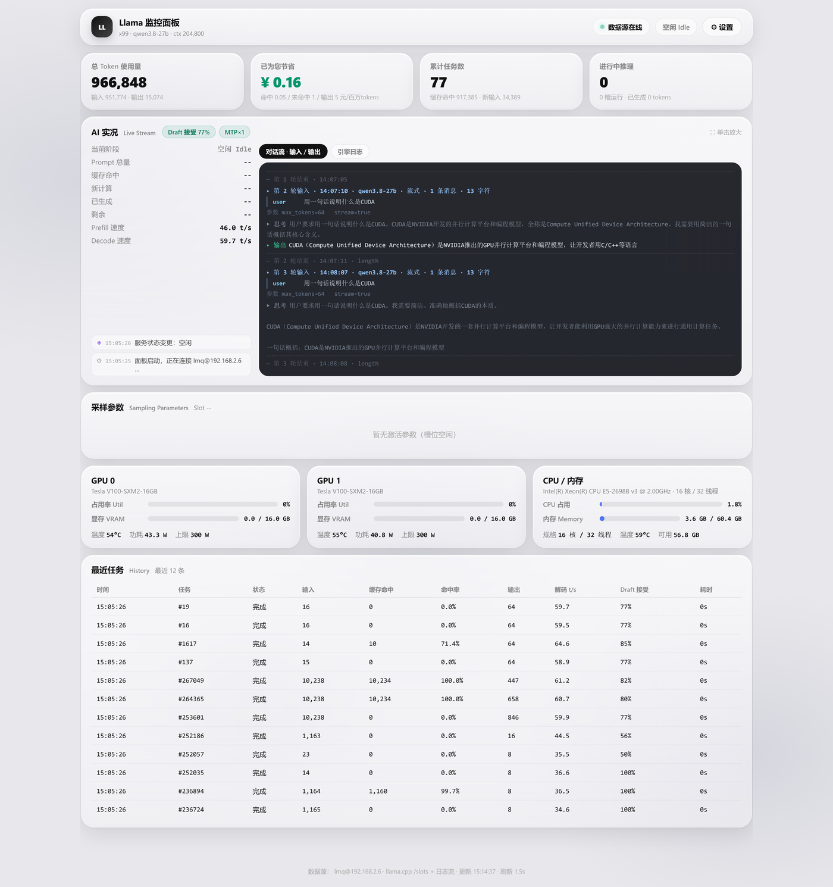
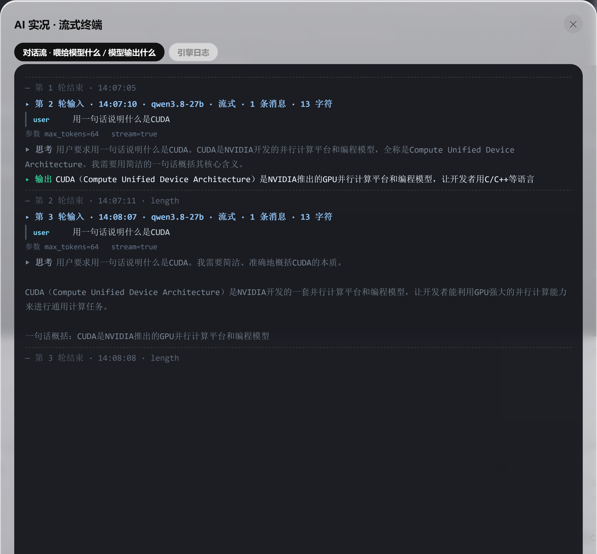

# llama-panel · 本地大模型监控面板

把一台 Linux 推理机（llama.cpp / 多卡 GPU）接到你的 Windows 桌面上：**双击安装包、填一次 SSH 地址和账号，安装向导自动把采集代理部署到远端并重启服务**，之后打开桌面图标就能实时看到 GPU、CPU、显存、吞吐、计费，以及**喂给模型什么、模型输出什么**的流式终端。





## 功能特性

| 模块 | 说明 |
| --- | --- |
| **AI 实况 · 流式终端** | 按增量拉取，实时打印每一次请求：`in`（喂给模型的 prompt、参数、消息条数）、`think`（思维链增量）、`out`（模型输出增量）、`end`（结束原因）。主面板只保留最近 14 段、更早的自动折叠，终端高度固定并自动跟到底；单击卡片放大看完整对话 |
| **引擎日志** | 同一处页签切换查看远端 llama-server 原始日志尾部 |
| **对话流 · 输入 / 输出** | 面板主区与放大页各一份，输入与输出分色标注，一眼看清上下文里到底塞了什么 |
| **GPU** | 每张卡的利用率、显存占用 / 总量、温度、功耗 / 功耗墙，多卡并排 |
| **CPU / 内存** | 占用率、温度、可用内存；**核数按 `(physical id, core id)` 去重统计物理核**，线程数取逻辑核，16C/32T 的机器显示为「16 核 / 32 线程」 |
| **任务与吞吐** | 每个 slot 的 pp / tg 速度、并发路数、上下文长度、命中率（缓存命中 token 占比）、草稿接受率 |
| **历史任务** | 最近任务列表：输入 token、命中率、输出 token、解码速度、耗时、截断标志 |
| **计费统计** | 缓存命中 / 输入未命中 / 输出三档单价可配，实时累计 token 与花费 |

## 工作原理

```
Windows 桌面                                 Linux 推理机
┌────────────────────────────┐   ssh      ┌───────────────────────────────┐
│ llama-monitor-panel.exe    │ ─────────► │ llama-panel-feeder.py         │
│  · 本地 HTTP 服务 + 面板页 │   0.6s     │  · tail llama-server 日志      │
│  · token 记账 / 事件流     │ ◄───────── │  · 读 /proc、nvidia-smi       │
│  · 内嵌 webview 窗口       │  JSON 行流 │  · tail panel-trace.jsonl     │
└────────────────────────────┘            │ llama-proxy-v2.py（写对话流） │
                                          │ llama-server（llama.cpp）     │
                                          └───────────────────────────────┘
```

1. 面板后端用 SSH 在远端拉起 `llama-panel-feeder.py`，采集进程每 0.6 秒输出一行 JSON；
2. 后端解析成 GPU / CPU / slot / 历史 / 事件流，喂给本地页面；
3. `llama-proxy-v2.py` 作为 llama-server 前面的代理，把每一次请求的输入与增量输出追加写进 `panel-trace.jsonl`，面板按序号增量拉取，形成「对话流」。

## 安装（Windows 一键）

1. 到 [Releases](https://github.com/lmq9622/llama-panel/releases/latest) 下载 `llama-panel-setup-1.0.0.exe`（约 53 MB）；
2. 双击运行，向导里填：

| 字段 | 说明 |
| --- | --- |
| 服务器地址 | 推理机 IP 或域名，例如 `192.168.2.6` |
| SSH 端口 | 默认 `22` |
| 登录用户名 | 同时用于 sudo |
| 登录密码 | **留空则自动改用本机私钥**（`~/.ssh/id_ed25519`、`id_rsa` 等）免密登录 |
| sudo 密码 | 留空表示与登录密码相同 |
| 远端安装目录 | 留空 = 远端用户主目录 |

只想先装面板、服务器稍后再填：把「服务器地址」留空即可跳过远端部署，之后在面板的「设置」里改。

3. 点下一步，向导通过 SSH 自动完成：
   - 探测远端 python3、llama-server、日志文件、chat template、`models/*.gguf`；
   - 备份并上传 `llama-panel-feeder.py`、`llama-proxy-v2.py`；
   - 写入远端 `~/llama-panel.json`（已存在则合并，不覆盖你手工改过的项）；
   - 确保 systemd 服务存在并重启，检查端口监听；
   - 回写本机 `panel-data/settings.json`。
4. 完成后桌面出现「Llama 监控面板」图标，双击即可。

安装包以**当前用户**权限安装（`PrivilegesRequired=lowest`），不弹 UAC、不写系统目录，卸载时清掉 `panel-data`。

## 从源码运行

```powershell
# 1. 本地依赖
pip install paramiko

# 2. 直接跑面板后端（会自动打开页面）
python server.py

# 3. 只想验证远端自动部署时，可以单独跑部署器
python deploy.py --host 192.168.2.6 --user lmq --password "" --remote-dir /home/lmq --log deploy.log
```

远端需要 `python3`；`nvidia-smi` 与 `/proc/cpuinfo` 缺失时会自动降级，不影响其余面板功能。

## 构建安装包

```powershell
# 1. 两个 exe（PyInstaller）
pyinstaller llama-monitor-panel.spec
pyinstaller deploy.spec

# 2. 安装包（Inno Setup 6，需自行安装 ISCC）
& "C:\Program Files (x86)\Inno Setup 6\ISCC.exe" installer\llama-panel.iss
# 产物：dist\llama-panel-setup-<版本>.exe
```

`deploy.spec` 把 `feeder.py` 与 `remote/llama-proxy-v2.py` 一起打进 exe，因此安装包自带全套远端文件，无需额外下载。

## 远端配置文件 `~/llama-panel.json`

安装向导生成的字段如下，缺项一律由 `feeder.py` 内置默认值兜底：

| 字段 | 含义 |
| --- | --- |
| `llama_bin` | llama-server 可执行文件路径 |
| `backend_log` | llama-server 日志路径（默认 `/home/lmq/llama-27b.log`） |
| `trace_path` | 对话流 jsonl 路径（默认 `<安装目录>/panel-trace.jsonl`） |
| `chat_template` | chat template 文件（可选） |
| `model_file` / `mmproj_file` | 模型与多模态投影文件 |
| `port_internal` / `port_external` | 内部 / 对外端口，默认 `18081` / `8081` |
| `alias` | 模型别名，默认 `qwen3.8-27b` |
| `service` | systemd 服务名，默认 `llama-servers` |

## 目录结构

| 文件 | 作用 |
| --- | --- |
| `server.py` | 本地后端：起 HTTP 服务、SSH 拉起远端采集、token 记账、事件流 |
| `panel.html` | 单文件前端：面板、对话流、AI 实况流式终端 |
| `feeder.py` | 远端采集代理：tail 日志、读 `/proc` 与 `nvidia-smi`、输出 JSON 行 |
| `remote/llama-proxy-v2.py` | 远端代理：转发请求并把输入 / 增量输出写进 `panel-trace.jsonl` |
| `deploy.py` | 部署器：探测远端、上传文件、写配置、重启 systemd 服务 |
| `llama-monitor-panel.spec` / `deploy.spec` | PyInstaller 打包描述 |
| `installer/llama-panel.iss` | Inno Setup 安装脚本（向导页 + 远端自动部署） |

## 说明

- 目前只在 Windows 10 / 11 x64 上验证过；
- 安装包未做代码签名，首次运行可能弹 SmartScreen「Windows 已保护你的电脑」，点「更多信息 → 仍要运行」即可；
- 面板默认只监听本机，SSH 凭据保存在本机 `panel-data/settings.json`，不会上传到任何地方。
- 图标取自 [llama.cpp](https://github.com/ggml-org/llama.cpp) 官方 `media/llama1-icon-transparent.png`（MIT），`assets/llama.ico` 由它生成。
